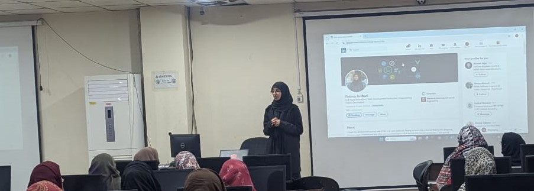

# Web-and-Mobile-Development-Batch-No-03

## Schedule

### Web & Mobile Development
| Days                 | Class Focus        | Completed Sections                  |
|----------------------|--------------------|-------------------------------------|
| Day 01: Saturday, 04/01/2025 | Orientation        | Introduction to Web & Mobile Development |
| Day 02: Sunday, 05/01/2025   | HTML               | Tags: Understanding Text           |
| Day 03: Saturday, 11/01/2025 | HTML               | Ordered List & Unordered List      |
| Day 04: Sunday,   12/01/2025 | HTML               | Anchor , Image tag                 |
| Day 05: Saturday, 18/01/2025 | HTML               | Tag: Table                         |
| Day 06: Sunday,   19/01/2025 | HTML               | Tag: From                          |
| Day 07: Saturday, 25/01/2025 | HTML               | Block&Inline,audio&video,div&span  |
| Day 08: Sunday,   26/01/2025 | CSS                | Color , Background-color , font-size padding , margin|
| Day 09: Saturday, 01/02/2025 | CSS                | Font & Text In CSS|
| Day 10: Sunday,   02/02/2025 | CSS                | Align , pseudo element , text-shadow|
| Day 11: Saturday, 08/02/2025 | CSS                | Boxes , width , height|
| Day 12: Sunday,   09/02/2025 | CSS                | Navbar or footer |
| Day 13: Saturday, 15/02/2025 | Off                | Day off |
| Day 14: Sunday,   16/02/2025 | CSS(4 hour)        | display , inline/block , flex |
| Day 15: Saturday, 22/02/2025 | Off                | Day off |
| Day 16: Sunday,   23/02/2025 | CSS(4 hour)        | Background Image & Form styling |
| Day 17: Saturday, 01/03/2025 | CSS                | Position & Transform |
| Day 18: Sunday,   02/03/2025 | CSS                | Transition & before  & after |
| Day 19: Saturday, 08/03/2025 | CSS                | Animation |
| Day 20: Sunday,   09/03/2025 | CSS                | Website hero section  |
| Day 21: Saturday, 15/03/2025 | CSS                | Grid Layout |
| Day 22: Sunday,   16/03/2025 | CSS                | Clamp , calc , repeat , bootstrap demo |
| Day 23: Saturday, 22/03/2025 | bootstrap          | Navbar 
| Day 24: Sunday,   23/03/2025 | bootstrap          | lg , md , sm 
| Day 25: Saturday, 29/03/2025 | bootstrap          | Cards , form
| Day 26: Sunday,   30/03/2025 | bootstrap          | Eid Cards
| Day 27: Saturday, 05/04/2025 | JavaScript         | Data Types , Console.log
| Day 28: Sunday,   06/04/2025 | JavaScript         | Operators
| Day 29: Saturday, 12/04/2025 | JavaScript         | Assignment Operator , Logical Operator
| Day 30: Sunday,   13/04/2025 | JavaScript         | Intro Array , Object , Function 
| Day 31: Saturday, 19/04/2025 | JavaScript         | Hackathon html and css website
| Day 32: Sunday,   20/04/2025 | JavaScript         | Responsive 
| Day 33: Saturday, 26/04/2025 | JavaScript         | for , while , if else condition
| Day 34: Sunday,   27/04/2025 | JavaScript         | Prompt , String (slice , charAt , upper , lower)
| Day 35: Saturday, 03/05/2025 | JavaScript         | String (split , concat ) , Array (toString)
| Day 36: Sunday,   04/05/2025 | JavaScript         |  Array (toString), concat , length , pop , push , unshift , shift , splice
| Day 37: Saturday,   10/05/2025 | JavaScript       | Map , sort or problem solve
| Day 38: Sunday,     11/05/2025 | JavaScript       | settimeout , setIntervel
| Day 39: Saturday,   17/05/2025 | JavaScript       | Json data Map
| Day 40: Sunday,     24/05/2025 | JavaScript       | Object 
| Day 41: Saturday,   31/05/2025 | JavaScript       | Input Validation , Constructor Object
| Day 42: Saturday,   01/05/2025 | JavaScript       | Callbacks
| -----------------> Eid Vocations --------------------> 
| Day 43: Saturday,   14/06/2025 | Tailwind CSS     | Callback js 
| Day 44: Saturday,   21/06/2025 | JavaScript       | Promise , Api Integration , fetch  
| Day 45: Sunday,     22/06/2025 | Test             | Html , CSS , Bootstrap & JavaScript MCQS Test 
| Day 46: Saturday,   28/06/2025 | JavaScript       | Destructure , type=module , spread operator 
| Day 47: Sunday ,    29/06/2025 | Off Day   
| Day 48: Saturday ,  05/07/2025 | Off Day   
| Day 49: Sunday ,    06/07/2025 | Off Day   
| Day 50: Saturday ,  12/07/2025 | JavaScript | local storage , cookies
| Day 51: Sunday ,  13/07/2025 | React | Installation , folder structure
| Day 52: Saturday ,    19/07/2025 | React | How to create the component & style implement
| Day 53: Sunday ,    20/07/2025 | React | Revise all topics
| Day 54: Saturday ,  26/07/2025 | React | React Router Dom , React Bootstrap , Navbar
| Day 55: Sunday ,    27/07/2025 | React | Map , JSX,JS , Json data , Virtual Dom
| Day 56: Saturday ,  02/08/2025 | React | State , hooks(useState) , tailwind css integration
---Meeting 1 hour : Javascript topic (DOM , Module)

